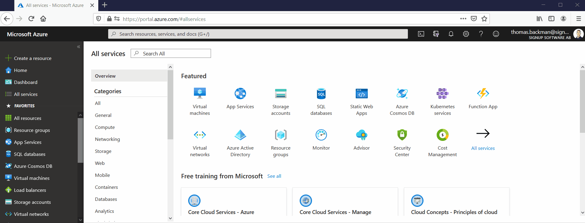

# PowerShell script ExFlow Web for D365O version 3

News in this version (V3) of the script: 
* Updated to use the new Azure Module (Az Module)
* Removes local dependency of DLL's by using AZ Cli instead (requires install)
    * New Registry method allows for extended usability of the Service Principal.
* Connects webapp to a Signup Hosted storage account for automatic updates.
    * Updates are now pushed to a storage account each month and will be automatically installed on the web app when restarted after time of release.
* Adds support to install multiple web apps to one resource group (Parameter "ResourceGroup" below)
* Adds support to install multiple web apps to one ASP when used together with the ResouceGroup parameter (Parameter "AppServicePlan" below) 
* Adds support for Storage Account CORS rules when using custom domains.

## Installation and updates

> [!IMPORTANT]  
> Powershell ISE has been deprecated and some issues has started to appear for users attempting to run the deployment script with Powershell ISE.
> Use the regular Powershell console or VS Code for future deployments.

ExFlow web is installed by running the following PowerShell script. See also ([Run-Deploy.ps1](https://github.com/signupsoftware/exflowwebd365o/blob/master/v3/Run-Deploy.ps1)) in *Powershell consol* or *Cloud shell*. 


```powershell
$Location                  = "westeurope" #Azure location such as northeurope,westeurope...
$Security_Admins           = "ADMIN" #Dynamics user name of ExFlow Web administrators. Use comma to separate. Admins can translate texts, write welecome messages, ...
$DynamicsAXApiId           = "https://axtestdynamics365aos.cloudax.dynamics.com" #URL to AX
$RepoURL                   = "https://raw.githubusercontent.com/signupsoftware/exflowwebd365o/master/V3/" #URL to GitHub or the download location for example c:\folder\. 
$ExFlowUserSecret          = "xxxxxxxxxxxxxxxxxxxxxx" #Your identity recieved by signupsoftware.com
$Prefix                    = "" #Optional prefix but recommended (short using alphanumeric characters). Name will be exflow[$prefix][xxxxxxxxxxx].
$PackageVersion            = "" #Optional version to install.  Leave blank for default behavior.
$MachineSize               = "" #App Service machine (AKA Service Plan) size F1=Free, D1=Shared, B1 (default) to B3= Basic, S1 to S3 = Standard, P1 to P3 = Premium  (see also https://azure.microsoft.com/en-us/pricing/details/app-service/)
$TenantGuid                = "" #Optional tenant id when you have multiple tenants (advanced). 
$WebAppSubscriptionGuid    = "" #Optional Subscription for the web app (advanced).
$UseApiName                = "" #Optional. Set to "true" use the same name as the left part of $DynamicsAXApiId e.g. axtestdynamics365aos. 
$ResourceGroup             = "" #Optional. Set a custom ResourceGroup name.
$AppServicePlan            = "" #Optional. Set a custom ASP name.
$AppControlMergeFile       = "App.AX.WS.xml?{ax365api1}=true;{UseDebugLog}=false;{Lines.RemoveOrginal}=true;{Lines.ChangeType}=true;{ForwardTo}=true;{ForwardTo.NoPrevious}=true;{Lang.All}=true;{Lines.UseLineTemplates}=true;{Lines.UseAsyncValidation}=true;{Labs.Vue.InAppSiteConfiguration}=true;" #Enables or disabled features in the web, leave as is for a standard deployment.


$Webclient                       = New-Object System.Net.Webclient
$Webclient.UseDefaultCredentials = $true
$Webclient.Proxy.Credentials     = $Webclient.Credentials
$Webclient.Encoding              = [System.Text.Encoding]::UTF8
$Webclient.CachePolicy           = New-Object System.Net.Cache.HttpRequestCachePolicy([System.Net.Cache.HttpRequestCacheLevel]::NoCacheNoStore)

$scriptPath = ($Webclient.DownloadString("$($RepoURL)App-RegistrationDeployment.ps1"))
Invoke-Command -ScriptBlock ([scriptblock]::Create($scriptPath)) -ArgumentList $Location,$Security_Admins,$DynamicsAXApiId,$RepoURL,$ExFlowUserSecret,$Prefix,$PackageVersion,$MachineSize,$TenantGuid,$WebAppSubscriptionGuid,$UseApiName,$ResourceGroup,$AppServicePlan,$AppControlMergeFile


```


The script installs all required Azure components into an Azure Resource Group. During installation, the web app is registered to communicate with the D365O API (web services). **Note that to apply product updates you just need to restart the app service when running V3**

## Az Module
To successfully run the script you will need an updated PowerShell version. The script also depends on the Azure module, 
written by Microsoft. PowerShell and the Azure Module update frequently and updates are rarely (never) backwards compatible. Also, all versions stack up making the environment a bit unstable/unpredictable. One way of avoiding this is to uninstall modules. 
```powershell
https://docs.microsoft.com/bs-latn-ba/powershell/azure/uninstall-az-ps
```
and then reinstall the module again
```powershell
https://docs.microsoft.com/en-us/powershell/azure/install-az-ps
```
Install AZ cli:
```powershell
Invoke-WebRequest -Uri https://aka.ms/installazurecliwindows -OutFile .\AzureCLI.msi; Start-Process msiexec.exe -Wait -ArgumentList '/I AzureCLI.msi /quiet'; rm .\AzureCLI.msi
```
https://docs.microsoft.com/en-us/cli/azure/install-azure-cli-windows?view=azure-cli-latest&tabs=azure-powershell

Finally close and reopen the PowerShell ISE console.

### Instructions:
1. Open PowerShell ISE
2. Change parameters (see inline comments)
3. Press Play
4. When prompted sign in using an Azure Subscription Contributor (or higher) account
5. If you are prompted for credentials again use an Azure AD user i.e. ...@company.com
6. Respond to additional prompts and wait until done.
7. Open URL and grant the app permissions 

If the text in the command window turns red or the script aborts something went wrong, see below section on errors.


### To run the script in Cloud shell:
* Note: Only recommended to use when installing the Web App in a Subscription that is tied to the same Azure Tenant as Dynamics F&O is installed in.
1. Open https://portal.azure.com
2. login with an account that has Contributor on subscription and is Allowed to create Azure AD Applications.
3. Open the Cloud Shell from the top-right menu and configure a storage account.
4. Edit the parameter in [Run-Deploy.ps1](https://github.com/signupsoftware/exflowwebd365o/blob/master/v3/Run-Deploy.ps1)
5. Copy and Paste the parameter script into the Cloud Shell window and run



*Sometimes the output in cloud shell might bug and all information is not displayed, restart your cloud shell session if this happens*
